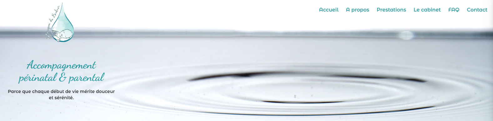
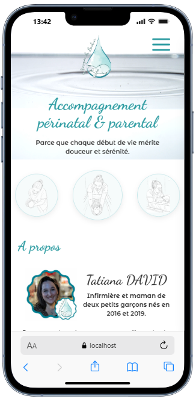

# À l’origine du bonheur – Site vitrine

## 🌿 Présentation

Site vitrine professionnel développé pour **Tatiana DAVID**, infirmière et accompagnante périnatale.  
L’objectif : proposer un espace doux, rassurant et moderne permettant aux futurs parents de découvrir les prestations, le cabinet, la FAQ et de contacter la professionnelle facilement.

---

## 📱 Aperçu mobile

Voici un aperçu du rendu sur smartphone :

  

---

## 🎨 Design & Identité

Le design complet du site (palette, mise en page, ambiance générale, intégration des illustrations) a été entièrement imaginé et réalisé par Alexandra Pastor.
L’identité repose sur une direction artistique douce, cocooning et apaisante, inspirée de l’univers périnatal.
- Palette douce et apaisante, centrée autour des thématiques de la naissance et de la parentalité  
- Illustrations personnalisées stylisées  
- Mise en page fluide, épurée et responsive  
- Expérience “one-page” avec navigation fluide (smooth scroll)

---

## 🛠️ Technologies utilisées

- **React + Vite**
- **React Router DOM**
- **Tailwind CSS (v4)**
- **React Slick**
- **React Toastify**
- **Custom hooks** (scroll to top, gestion menu…)
- **Déploiement Vercel**

---

## 📄 Fonctionnalités
- One-page principale avec les sections : A propos, Prestations, Cabinet, FAQ, Contact
- Pages légales dédiées :
  - *Mentions légales*
  - *Politique de confidentialité*
- Navigation fluide entre les sections et les pages
- Menu burger mobile animé
- Formulaire de contact
- Illustrations personnalisées intégrées en bandeau décoratif
- Design 100% responsive, mobile-first

---

## 🚀 Installation & lancement
# Installation
npm install

# Lancement du projet
npm run dev

---

## 👩‍💻 Développement
Projet conçu et développé par **Alexandra Pastor**, développeuse full-stack & créatrice de l'identité visuelle du site.